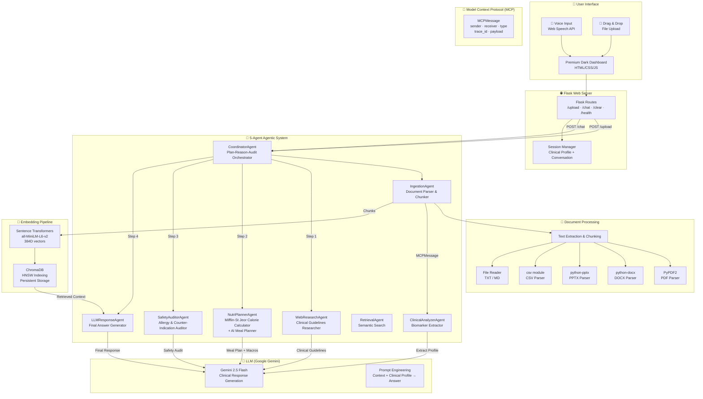

# 🧬 NutriMind AI — System Architecture

> Next-Gen Agentic Health & Diet Companion  
> Multi-Agent RAG with Model Context Protocol (MCP)

---

## 1. System Architecture Overview



---

## 2. Multi-Agent Architecture

NutriMind AI implements a **5-agent agentic system** where each agent has a specialized role. They communicate via the **Model Context Protocol (MCP)** — a structured message-passing system that logs every inter-agent interaction for full transparency.

### Agent Roster

| Agent | Role | Input | Output |
|---|---|---|---|
| **CoordinatorAgent** | Orchestrates Plan-Reason-Audit loop | User query + clinical profile | Final unified response |
| **IngestionAgent** | Parses multi-format documents into chunks | File paths (.pdf, .docx, etc.) | Text chunks for embedding |
| **ClinicalAnalyzerAgent** | Extracts structured biomarker profiles from health reports | Text chunks | JSON clinical profile (demographics, biomarkers, goals, allergies) |
| **WebResearchAgent** | Searches for clinical guidelines (WHO, ADA, AHA) based on conditions | Medical conditions + query | Research note with dietary mandates |
| **NutriPlannerAgent** | Calculates calorie/macro targets (Mifflin-St Jeor) and generates meal plans | Clinical profile + research note | Calorie targets + 4-meal plan (JSON) |
| **SafetyAuditorAgent** | Audits proposed meals against allergies, drug interactions, and biomarker conflicts | Profile + meal plan | Corrected meal plan + audit report |
| **RetrievalAgent** | Performs semantic vector search in ChromaDB | Query string | Relevant document chunks |
| **LLMResponseAgent** | Generates the final natural language response | Context + query | Answer text |

### Plan-Reason-Audit Loop (Query Pipeline)

```
User Query
    │
    ▼
┌─────────────────────────┐
│  CoordinatorAgent       │
│  (Orchestrator)         │
└─────────┬───────────────┘
          │
          ├──► Step 1: WebResearchAgent
          │    └── Searches clinical guidelines for conditions/biomarkers
          │
          ├──► Step 2: NutriPlannerAgent
          │    └── Calculates TDEE, macros, generates meal plan
          │
          ├──► Step 3: SafetyAuditorAgent
          │    └── Reviews meal plan for allergies, drug interactions
          │    └── Corrects unsafe ingredients
          │
          └──► Step 4: LLMResponseAgent
               └── Synthesizes all findings into final response
               └── Uses ChromaDB vector context for grounding
```

---

## 3. Technology Stack

| Layer | Technology | Purpose |
|---|---|---|
| **Frontend** | HTML5, Vanilla CSS, JavaScript | Premium dark glassmorphic dashboard |
| **Backend** | Flask (Python) | REST API server |
| **LLM** | Google Gemini 2.5 Flash | Clinical reasoning & response generation |
| **Embeddings** | SentenceTransformers (all-MiniLM-L6-v2) | 384D dense vector embeddings |
| **Vector DB** | ChromaDB (HNSW + Persistent) | Semantic similarity search |
| **Document Parsing** | PyPDF2, python-docx, python-pptx | Multi-format clinical report ingestion |
| **Protocol** | Model Context Protocol (MCP) | Inter-agent message passing & tracing |
| **Voice** | Web Speech API | Browser-native voice input |

---

## 4. Directory Structure

```
project-root/
├── app.py                    # Unified Flask server (ChromaDB + 5-Agent RAG)
├── agents/
│   ├── __init__.py           # Package exports
│   ├── coordinator_agent.py  # Orchestrator — Plan-Reason-Audit loop
│   ├── health_agents.py      # ClinicalAnalyzer, WebResearcher, NutriPlanner, SafetyAuditor
│   ├── ingestion_agent.py    # Multi-format document parser
│   ├── retrieval_agent.py    # ChromaDB semantic search agent
│   ├── llm_response_agent.py # Gemini LLM wrapper + response agent
│   ├── embedding_utils.py    # SentenceTransformers + ChromaDB vector store
│   ├── document_utils.py     # PDF/DOCX/PPTX/CSV/TXT parsers
│   └── mcp.py                # MCPMessage protocol definition
├── templates/
│   └── index.html            # Premium dark wellness dashboard
├── static/
│   ├── css/styles.css        # Glassmorphic dark theme stylesheet
│   └── js/app.js             # Interactive dashboard logic
├── chroma_advanced/          # ChromaDB persistent vector storage
├── uploads/                  # Temporary file upload directory
├── requirements.txt          # Python dependencies
├── requirements-local.txt    # Local dev dependencies
├── ARCHITECTURE.md           # This file
└── README.md                 # Project documentation
```

---

## 5. Data Flow

### Upload Flow
1. User drops clinical report (PDF/DOCX/CSV/TXT)
2. Flask saves file temporarily → passes to **IngestionAgent**
3. IngestionAgent parses document into text chunks via document_utils
4. **ClinicalAnalyzerAgent** sends chunks to Gemini to extract structured biomarker profile (JSON)
5. Chunks are embedded via SentenceTransformers and stored in **ChromaDB**
6. Profile is saved to Flask session; dashboard updates with biomarkers and vitals

### Query Flow
1. User asks a health/nutrition question
2. **CoordinatorAgent** orchestrates the Plan-Reason-Audit loop:
   - **WebResearchAgent** → researches clinical guidelines via Gemini
   - **NutriPlannerAgent** → calculates calorie/macro targets, generates meal plan via Gemini
   - **SafetyAuditorAgent** → audits meal plan for allergy/condition conflicts via Gemini
   - **LLMResponseAgent** → generates final answer using ChromaDB context + audit findings
3. All MCP traces are returned to the frontend for the Agent Thought Terminal
4. Dashboard updates with new meal plan, macro targets, and agent trace logs

---

## 6. Key Design Decisions

- **Agentic RAG over simple RAG**: Each agent has a specialized role. The system reasons in steps (plan, research, generate, audit) rather than doing a single LLM call. This produces more reliable, safety-checked clinical advice.
- **MCP Tracing**: Every inter-agent message is logged as an MCPMessage with sender, receiver, type, and payload. This provides full transparency and debuggability visible in the Agent Thought Terminal.
- **ChromaDB + HNSW**: Persistent vector storage with cosine similarity indexing. Survives server restarts.
- **Mifflin-St Jeor Equation**: Scientifically validated BMR calculation for personalized calorie targets.
- **Safety Audit Loop**: The SafetyAuditorAgent acts as a "critique layer" — it reviews meal plans against allergies, drug interactions, and biomarker conflicts before serving to the user.
