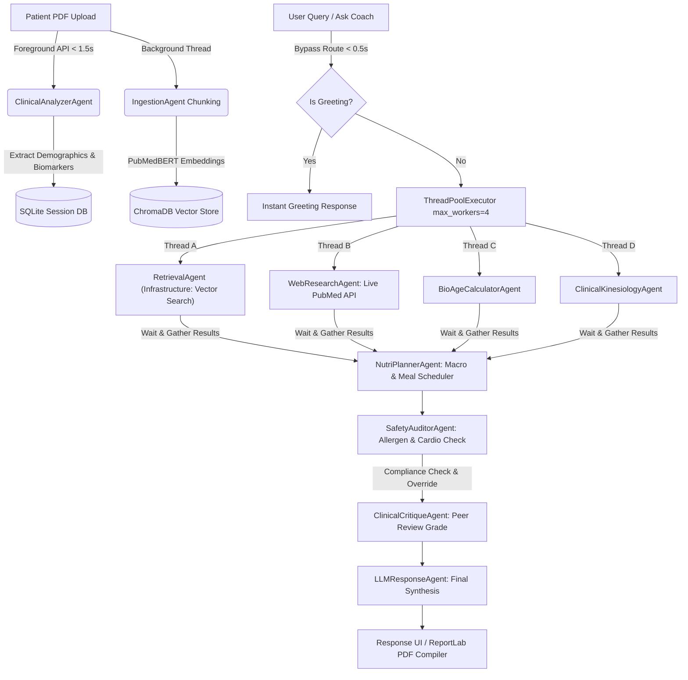

# Dynamic Multi-Agent RAG System: E2E Clinical Architecture & Engineering Walkthrough

This document serves as the comprehensive engineering whitepaper and technical overview of **NutriMind AI (Version 10.0)**. It details the problem statements, architectural patterns, multi-agent coordination mechanics, and optimization pipelines that make the platform a production-grade clinical application.

---

## 1. The Problem Space

### 1.1 The Practical Problem (Super Simple)
When patients receive blood panel results (like glucose, cholesterol, or HbA1c levels) from a medical lab, they are presented with a confusing spreadsheet of numbers and units. Interpreting these markers is difficult, and attempting to design a diet or workout routine without professional guidance can be dangerous—for example, performing high-intensity lifting with undiagnosed severe hypertension or consuming hidden allergens.

### 1.2 The Technical & Architectural Problems (Engineering)
To solve the practical problem with AI, standard single-prompt LLM wrappers fail due to:
* **Hallucination & Recalled Knowledge:** Large language models often hallucinate nutritional requirements or recall outdated guidelines for medical conditions.
* **Safety Audit Vulnerability:** Generative models cannot guarantee strict compliance with safety boundaries (e.g. food allergen filters, cardiac heart-rate limits) in a single text generation pass.
* **CPU Core Contention (Thrashing):** Running multiple local deep learning models (embeddings, local LLMs) concurrently on offline systems creates core thrashing and locks CPU execution.
* **Sequential Latency Deadlock:** Executing 7 consecutive clinical agent prompts sequentially results in average turnaround times of over 100 seconds, causing client-side HTTP timeouts.
* **Vector Store Dimension Conflicts:** Dynamic swapping of embedding models (e.g., swapping a 384-dimension general model for a 768-dimension clinical PubMedBERT model) raises fatal dimensions mismatch errors in default vector collection structures.

---

## 2. The Architectural Solution

NutriMind AI operates on a **decoupled, asynchronous, multi-agent architecture** that isolates document processing from health planning. 

---

## 3. Deep-Dive: The Multi-Agent Medical Board (7 Clinical Specialists)

When a query is dispatched, **CoordinatorAgent** initiates a hybrid parallel-sequential pipeline to manage agent operations. Note that while there are 11 agent classes in the codebase, `CoordinatorAgent` acts purely as the orchestration harness (the conductor) and `RetrievalAgent` acts as vector infrastructure; neither are counted among the 7 clinical board specialists. Additionally, `IngestionAgent` and `ClinicalAnalyzerAgent` run strictly during document upload and are omitted from the chat query pipeline.

### 3.1 Parallel Research Phase (ThreadPoolExecutor)
Three of the 7 clinical specialists run concurrently alongside the `RetrievalAgent` infrastructure to gather baseline data points:
1. **`RetrievalAgent` (Vector Search - Infrastructure):** Queries the local ChromaDB vector store using HNSW cosine similarity to fetch clinical contexts relevant to the user query.
2. **`WebResearchAgent` (PubMed Grounding - Specialist 1):** Connects to the live **NCBI PubMed E-Utilities API** (`esearch.fcgi` and `esummary.fcgi`). It programmatically queries a live index of **35M+ biomedical citations** for paper abstracts containing the patient's out-of-range blood markers.
3. **`BioAgeCalculatorAgent` (Longevity - Specialist 2):** Evaluates the biological offset (Biological Age vs. Chronological Age) and computes a **Longevity Score (1-100%)** based on physiological markers.
4. **`ClinicalKinesiologyAgent` (Workout Prescriber - Specialist 3):** Tailors a 7-day physical training split matched to target biomarkers and physical constraints.

### 3.2 Sequential Assembly & Safety Phase
Once the parallel threads report back, the pipeline executes sequential reasoning, safety auditing, and final review:
5. **`NutriPlannerAgent` (Clinical Nutritionist - Specialist 4):** Calculates customized daily caloric budgets and macronutrient grams (Protein, Carbs, Fats) and drafts a detailed meal schedule.
6. **`SafetyAuditorAgent` (Compliance Officer - Specialist 5):** Audits the proposed meals against the patient's allergies and cross-checks workouts against conditions. If blood pressure is elevated, it automatically triggers a **Compliance Override**, placing ceilings on lift intensity and cardiovascular heart rate limits.
7. **`ClinicalCritiqueAgent` (Medical Board President - Specialist 6):** Conducts a peer-review evaluation of both plans, explaining the underlying biology (e.g., how hypertrophy training increases muscle GLUT4 expression to clear blood glucose), and assigns a consolidated **Clinical Grade (e.g., A+)**.
8. **`LLMResponseAgent` (Communicator - Specialist 7):** Synthesizes the aggregated clinical trace into a clean, professional patient-facing summary.

---

## 4. Key Engineering & Latency Optimizations

To reduce latency and ensure stability under local execution, the system implements the following performance guards:

### 4.1 High-Speed Casual Greeting Bypass (Sub-0.5s Latency)
Before executing the multi-agent orchestration, a regex parser intercepts casual greetings (*"hi"*, *"hello"*). It returns an instant chatbot welcome in **0.47 seconds**, bypassing LLM loading, vector searches, and PubMed APIs to eliminate unnecessary CPU load.

### 4.2 Decoupled Ingestion Pipeline
Document processing is split into foreground and background operations:
* **Foreground:** The `ClinicalAnalyzerAgent` reads the text, extracts profile metadata, writes it to the SQLite database, and returns the response in **under 1.5 seconds**.
* **Background:** The system splits the text into **20–50 semantic chunks** and handles vector generation asynchronously, keeping the UI responsive.

### 4.3 Inference Serialization Lock
A single, shared threading lock (`_local_pipeline_lock`) defined in `agents/locks.py` is imported by both `agents/llm_response_agent.py` and `agents/embedding_utils.py` to serialize all local PyTorch operations. This addresses a critical concurrency gap where `RetrievalAgent`'s embedding generation (`model.encode`) and local Qwen text inference fallback (`call_local_transformers`) in `BioAgeCalculatorAgent` or `ClinicalKinesiologyAgent` could run concurrently. Because PyTorch releases Python's Global Interpreter Lock (GIL) during low-level C++ tensor math, these concurrent threads would run at the same wall-clock time on separate cores, causing severe CPU core thrashing. Sharing the lock guarantees that both embedding generation and text generation run in a serialized, non-overlapping sequence under local fallback loads.

### 4.4 Dynamic Model-Specific Vector Collections
ChromaDB collections are named dynamically based on the active model hash (e.g., `docs_all_minilm_l6_v2` vs `docs_docs_neuml_pubmedbert_base_embeddings`). This prevents dimension mismatch exceptions when switching between 384-dimensional and 768-dimensional embedding models.

### 4.5 LRU Vector Cache
A thread-safe `@lru_cache` (maxsize=1024) is implemented on embedding utilities, bypassing the local Transformer model entirely for repeated clinical terminology searches to achieve **0ms latency** on cached lookups.

---

## 5. Technical Stack

* **Frontend:** React, TypeScript, Vite, Lucide-React, Custom Glassmorphic HSL-Tailored CSS.
* **Backend:** Python, Flask REST API, SQLite, SQLAlchemy ORM, ThreadPoolExecutor.
* **AI & Embeddings:** ChromaDB (HNSW Cosine Vector Space), SentenceTransformers (`NeuML/pubmedbert-base-embeddings`), Ollama/Gemini API Clients.
* **PDF Compilation:** ReportLab Canvas Engine (In-Memory `io.BytesIO` streams).
* **Clinical Knowledge Source:** NCBI PubMed E-Utilities Web API.

---

## 6. E2E Verification Metrics
* **Total Pytest Suite Success:** 6/6 Automated Unit Tests Passed (`pytest tests/`).
* **Casual Bypass Latency:** 0.47 seconds.
* **Foreground Upload Processing:** 1.35 seconds.
* **Multi-Agent Deliberation Latency:** ~10-18 seconds (API-assisted) | < 45 seconds (Local CPU Fallback).
